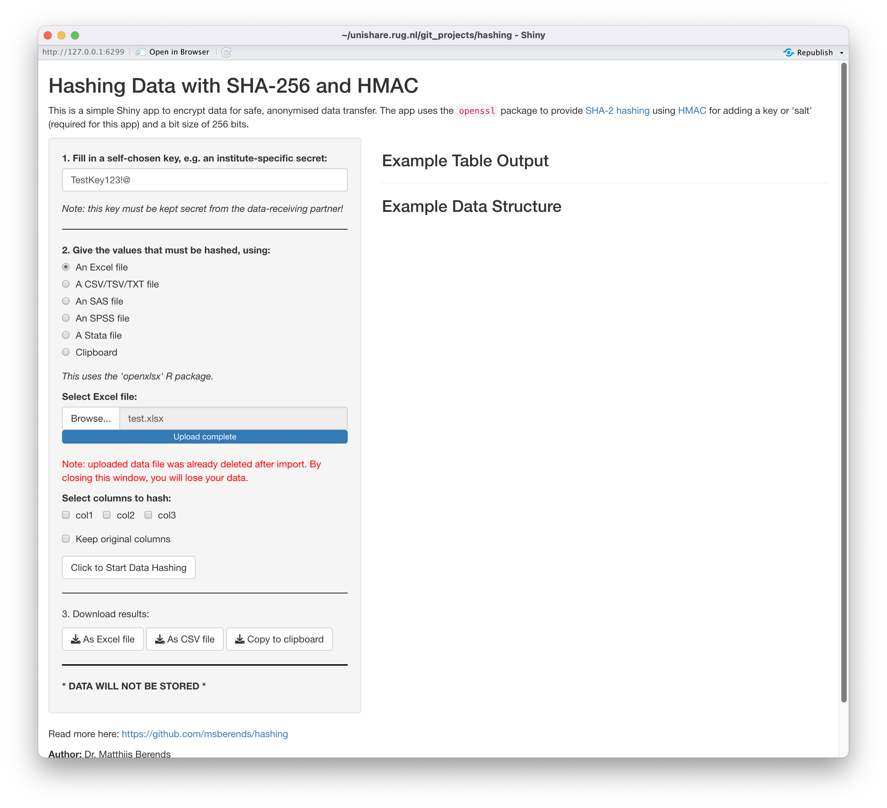

# `hashing`

This is a simple [Shiny app](https://shiny.rstudio.com) to encrypt data for safe, anonymised data transfer. It supports MS Excel files, SAS files, SPSS files, Stata files, flat files (CSV, TSV, TXT), and clipboard data.

## About the hashing

The app uses the `openssl` package to provide [SHA-2 hashing](https://en.wikipedia.org/wiki/SHA-2) using [HMAC](https://en.wikipedia.org/wiki/HMAC) for adding a key or 'salt' (required for this app) and a bit size of 256 bits. According to the [`openssl` documentation](https://rdrr.io/cran/openssl/man/hash.html):

> *In applications where hashes should be irreversible (such as names or passwords) it is often recommended to use a random key for HMAC hashing. This prevents attacks where we can lookup hashes of common and/or short strings. See examples. A common special case is adding a random salt to a large number of records to test for uniqueness within the dataset, while simultaneously rendering the results incomparable to other datasets.*

For this reason, it is mandatory in this app to fill in a self-chosen key, that is private to your data-receiving partner. This way, the data-receiving partner can never reproduce the hashes generated with SHA-2, unless the partner knows the key. This renders the data anonymous.

To hash in R without this Shiny app, do something like this:

``` r
library(openssl)
example_data_set <- data.frame(labid = c("1837473", "2442728"),
                               patid = c("987239487", "987239487"),
                               date = c(Sys.Date() - 10, Sys.Date()))
head(example_data_set)
#>     labid     patid       date
#> 1 1837473 987239487 2022-07-29
#> 2 2442728 987239487 2022-08-08

# The actual hashing, we use the key "TestKey123!"
example_data_set$labid <- sha256(example_data_set$labid, key = "TestKey123!")
example_data_set$patid <- sha256(example_data_set$patid, key = "TestKey123!")
head(example_data_set)
#>                               labid                              patid        date
#> 1 cc4a284d642790577386544230cf94...  c7c94ce293db4f4598cb532084e3b2...  2022-07-29
#> 2 50406f84c4013484d12353640fcc21...  c7c94ce293db4f4598cb532084e3b2...  2022-08-08
```

Please note that the `openssl::sha*()` functions require the input to be of class `character`. Numeric values have to be transformed using e.g. `as.character()`.

## Run this app locally (requires R)

1.  Download this file to your computer: [`app.R`](https://github.com/msberends/hashing/blob/main/app.R)

2.  Load the app using either of these options:

    1.  Open it in RStudio and press the "Run App" button, OR

    2.  Run `source("path/to/app.R")` using the command line

    Required packages will be installed automatically if they are missing.

3.  Use the user interface (see below)

## Run this app in the cloud

This app is published in the cloud at ShinyApps.io, the Shiny server of RStudio.

1.  Open the URL [https://berends.shinyapps.io/hashing/](http://berends.shinyapps.io/hashing/)
2.  Use the user interface (see below). **Uploaded files will not remain stored and will be deleted immediately after import.**

## User Interface

The app requires to fill in a key first.


After filling in a key, several options become available to add data:


Immediately after uploading and processing the data, the uploaded file is removed from the app. This means that with closing the app you will lose your data.



Click the button to show the data:


Select the column names that must be hashed, and click the button again:


Download the results and share them!

------------------------------------------------------------------------
